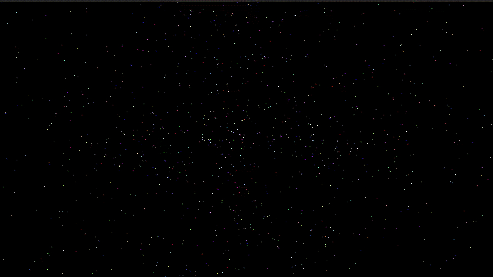

# Universe
:collision: Universe simulator



## Overview

The Universe Simulator is a C++ program that generates a 3D scene simulating celestial bodies' movement in space. It offers a range of functionalities for interacting with and controlling the simulation, including camera manipulation, simulation pause/resume/reset, and viewing modes.

## Functionalities

- **Simulation Control**: Pause, resume, and reset the simulation.
- **Camera Manipulation**: Move, zoom, and rotate the camera to view the universe from different angles.
- **Viewing Modes**: Choose between free mode, follow mode, and preset mode for different perspectives.
- **Trajectory Visualization**: Toggle object trajectories to visualize their paths in space.
- **Octree View**: Display the universe's division into smaller regions for efficient calculations.
- **Interaction**: Interact with the simulation through keyboard and mouse inputs.
- **Configuration**: Customize simulation settings using a configuration file.

## Getting Started

### Compilation

1. Clone the repository:

```bash
git clone https://github.com/miguelcsx/universe.git
```

2. Navigate to the project directory:

```bash
cd universe
```

3. Compile the project:

To compile the program, you can use the provided run script.
The script will create a build directory, compile the source files, and generate an executable.

```bash
chmod +x run.sh
./run.sh
```

### Execution

```bash
./build/universe
```

## Dependencies

The Universe Simulator uses the following libraries:

- **OpenGL**: Graphics rendering library.
- **GLFW**: Window and input handling library.
- **GLM**: Mathematics library for graphics software.
- **ImGui**: User interface library for OpenGL applications.
- **OpenACC**: API for parallel computing on accelerators.

## Structure

The project is structured as follows:

- **src**: Source files for the Universe Simulator.
- **include**: Header files for the Universe Simulator.
- **lib**: External libraries used by the project.

## Usage

- **WASD**: Move the camera forward, backward, left, and right.
- **QE**: Move the camera up and down.
- **Mouse Movement**: Rotate the camera by moving the mouse.
- **Scroll**: Zoom in and out.
- **Space**: Pause/resume the simulation.
- **R**: Reset the simulation.
- **U**: Toggle menu visibility.
- **Menu Options**: Control the simulation, camera, and viewing modes.

## License

This project is licensed under the MIT License. See the [LICENSE](LICENSE) file for details.
